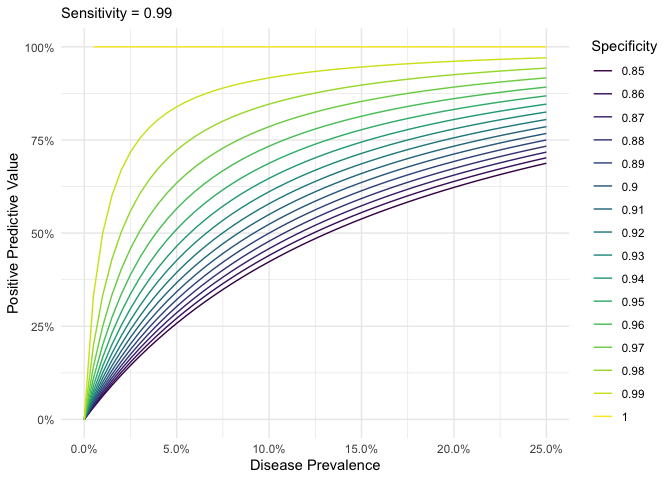
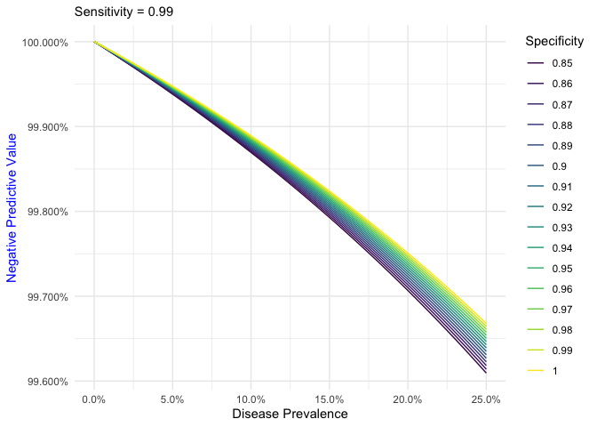
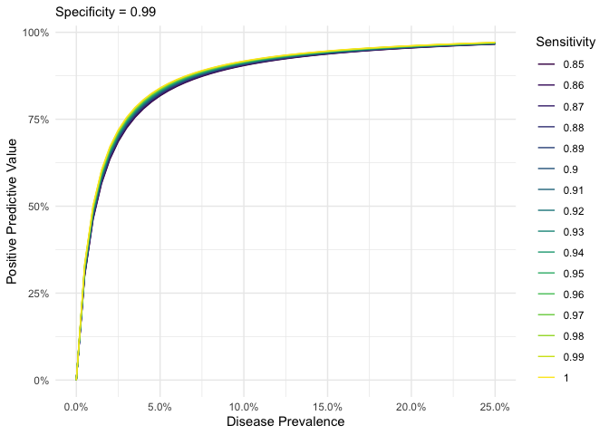
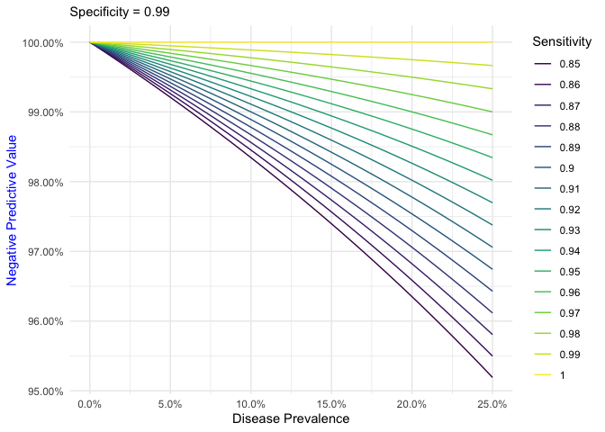

Diagnostic Performance in Low Disease Prevalence Settings
================
The Inflammatory Bowel and Immunobiology Research Institute (IBIRI)
4/23/2020

``` r
library(dplyr)
library(ggplot2)
library(tidyr)
library(patchwork)
```

## Define PPV and NPV Functions

``` r
# positive predictive value
# p = disease prevelance
# sens = sensitivity
# spec = specificity

ppv <- function(sens, spec, p) {
  (sens * p) / ((sens * p) + ((1-spec) * (1-p)))
}

# negative predictive value
npv <- function(sens, spec, p) {
  (spec * (1 - p)) / (((1-sens) * p) + (spec * (1-p)))
}
```

From Altman, D.G., Bland, J.M. (1994) *Diagnostic tests 2: predictive
values* British Medical Journal, vol 309, 102
[doi: 10.1136/bmj.309.6947.102](https://dx.doi.org/10.1136%2Fbmj.309.6947.102)

**Positive predictive value** is the proportion of patients with
positive test results who are correctly diagnosed.

**Negative predictive value** is the proportion of patients with
negative test results who are correctly diagnosed.

## Variability in Specificity

#### Specificity Has a Large Impact on the PPV in Low P Setting

``` r
# ppv vary spec and p
sens <- 0.99
spec <- seq(0.85, 1, by = 0.01)
p <- seq(0,0.25, by = 0.005)

output <- vector("list", length = length(spec))
for (i in seq_along(spec)) {
  output[[i]] <- sapply(p, ppv, spec = spec[[i]], sens = sens)
}
names(output) <- spec
df <- bind_rows(output) %>%
  mutate(p = p)

p1 <- df %>%
  gather(key = "spec", value = "ppv", -p) %>%
  ggplot(aes(x = p, y = ppv, color = spec)) +
  geom_line() +
  theme_minimal() +
  scale_y_continuous(labels = scales::percent) +
  scale_x_continuous(labels = scales::percent) +
  scale_color_viridis_d() +
  labs(x = "Disease Prevalence", y = "Positive Predictive Value", 
        subtitle = "Sensitivity = 0.99", color = "Specificity")

p1
```

    ## Warning: Removed 1 rows containing missing values (geom_path).

<!-- -->

For a disease prevalence `p` of 2.5%, increasing the specificity `spec`
from 85% to 95%, results in the positive predictive value `ppv`
increasing from 14.47% to 33.67% with a test sensitivity set at 99%.

#### Specificity Has a Small Impact on the NPV in Low P Setting

``` r
#npv vary spec and pd
sens <- 0.99
spec <- seq(0.85, 1, by = 0.01)
p <- seq(0,0.25, by = 0.005)

output <- vector("list", length = length(spec))
for (i in seq_along(spec)) {
  output[[i]] <- sapply(p, npv, spec = spec[[i]], sens = sens)
}
names(output) <- spec
df <- bind_rows(output) %>%
  mutate(p = p)

p2 <- df %>%
  gather(key = "spec", value = "npv", -p) %>%
  ggplot(aes(x = p, y = npv, color = spec)) +
  geom_line() +
  theme_minimal() +
  scale_y_continuous(labels = scales::percent) + 
  scale_x_continuous(labels = scales::percent) +
  scale_color_viridis_d() +
  theme(axis.title.y = element_text(colour = "blue"))+
  labs(x = "Disease Prevalence", y = "Negative Predictive Value", 
        subtitle = "Sensitivity = 0.99", color = "Specificity")

p2
```

<!-- -->

For a disease prevalence `p` of 2.5%, increasing the specificity `spec`
from 85% to 95%, results in the negative predictive value `npv`
increasing from 99.9698% to 99.973% with a test sensitivity set at 99%.

## Variability in Sensitivity

#### Sensitivity Has a Small Impact on the PPV in Low P Setting

``` r
# ppv vary sens and p
sens <- seq(0.85, 1, by = 0.01)
spec <- 0.99
p <- seq(0,0.25, by = 0.005)

output <- vector("list", length = length(sens))
for (i in seq_along(sens)) {
  output[[i]] <- sapply(p, ppv, sens = sens[[i]], spec = spec)
}
names(output) <- sens
df <- bind_rows(output) %>% 
  mutate(p = p)

p3 <- df %>%
  gather(key = "sens", value = "ppv", -p) %>%
  ggplot(aes(x = p, y = ppv, color = sens)) +
  geom_line() +
  theme_minimal() +
  scale_y_continuous(labels = scales::percent) +
  scale_x_continuous(labels = scales::percent) +
  scale_color_viridis_d() +
  labs(x = "Disease Prevalence", y = "Positive Predictive Value", 
      subtitle = "Specificity = 0.99", color = "Sensitivity")

p3
```

<!-- -->

For a disease prevalence `p` of 2.5%, increasing the sensitivity `sens`
from 85% to 95%, results in the positive predictive value `ppv`
increasing from 68.55% to 70.9% with a test specificity set at 99%.

#### Sensitivity Has a Small Impact on the NPV in Low P Setting

``` r
# npv vary sens and p
sens <- seq(0.85, 1, by = 0.01)
spec <- 0.99
p <- seq(0,0.25, by = 0.005)

output <- vector("list", length = length(sens))
for (i in seq_along(sens)) {
  output[[i]] <- sapply(p, npv, sens = sens[[i]], spec = spec)
}
names(output) <- sens
df <- bind_rows(output) %>% 
  mutate(p = p)

p4 <- df%>%
  gather(key = "sens", value = "npv", -p) %>%
  ggplot(aes(x = p, y = npv, color = sens)) +
  geom_line() +
  theme_minimal() +
  theme(axis.title.y = element_text(colour = "blue"))+
  scale_y_continuous(labels = scales::percent) +
  scale_x_continuous(labels = scales::percent) +
  scale_color_viridis_d() +
  labs(x = "Disease Prevalence", y = "Negative Predictive Value", 
       subtitle = "Specificity = 0.99", color = "Sensitivity")

p4
```

<!-- -->

For a disease prevalence `p` of 2.5%, increasing the sensitivity `sens`
from 85% to 95%, results in the negative predictive value `npv`
increasing from 99.61% to 99.87% with a test specificity set at 99%.

``` r
p5 <- (p1 | p2) / (p3 | p4) +
  plot_annotation(title = "Diagnostic Performance in Low Disease Prevalence Setting",
                  tag_levels = "A") 
ggsave("four_fig_panel.png", plot = p5, device = "png", width = 11, height = 11, units = "in")
```

    ## Warning: Removed 1 rows containing missing values (geom_path).

A panel figure with all 4 plots is saved as a separate file in this
repository.

<a rel="license" href="http://creativecommons.org/licenses/by/4.0/"></a><br />This
work is licensed under a
<a rel="license" href="http://creativecommons.org/licenses/by/4.0/">Creative
Commons Attribution 4.0 International License</a>.
